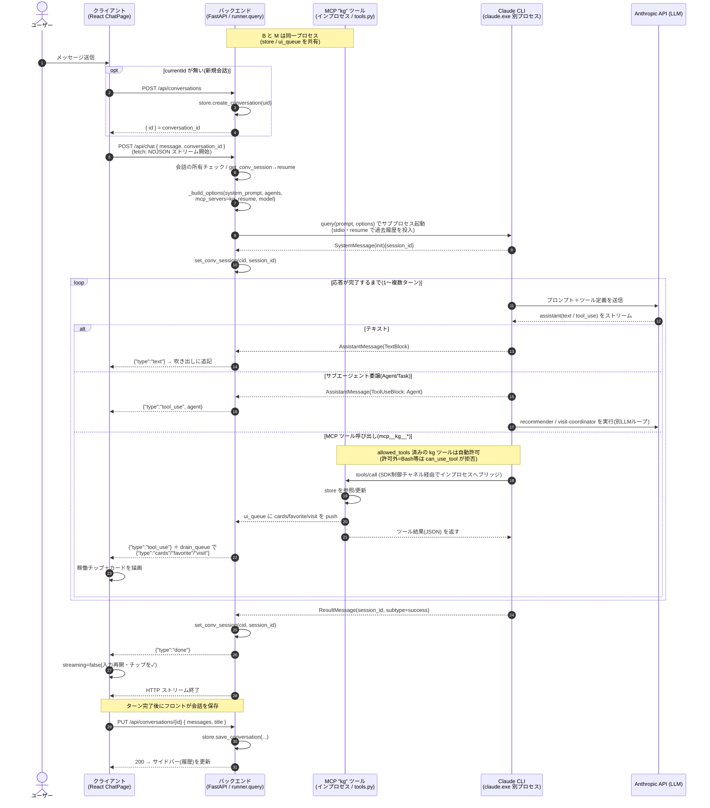

# シーケンス図: チャット受付〜応答完了

クライアントのメッセージ送信から応答完了までの、
**クライアント ⇔ バックエンド(Agent/REST) ⇔ Claude CLI ⇔ MCP ⇔ LLM** 間の通信フロー。

- **Backend と MCP(kg) は同一プロセス**（インプロセス MCP。`store` / `ui_queue` を共有）
- **Claude CLI（`claude.exe`）は別サブプロセス**（SDK が起動、stdio で通信）
- **Anthropic API（LLM）はリモート**（呼ぶのは CLI）

## 図の読みどころ（対応コード）

- **受付**: `C: runChat` → `POST /api/chat`（`frontend/src/api/chatStream.ts`）→ `backend/app/routers/chat.py` → `stream_chat`。
- **LLM 実行の起点**: `backend/app/agent/runner.py` の `async for msg in query(...)`。ここで CLI が起動し、CLI が LLM と会話する。私たちの Python は直接 API を叩かない。
- **MCP は CLI がクライアント**: `mcp__kg__*` は CLI が要求 → SDK 制御チャネルで **同一プロセス内** の `M`（`backend/app/agent/tools.py`）へブリッジ実行（ネットワーク無し）。`M` は `store` を直接操作し、`ui_queue` にカード等を push する。
- **2 系統の合流**: `B` は「SDK メッセージ（text/tool_use/done）」と「ui_queue（cards/favorite/visit）」を各メッセージ後の `drain_queue` で 1 本の NDJSON にまとめて `C` へ送出する（`.claude/rules/architecture.md` のストリーミング契約）。
- **セッション継続**: `init` と `ResultMessage` で `set_conv_session`。次ターンは `resume` で履歴を LLM に再投入する。
- **履歴保存**: 応答完了後に `C` が `PUT /api/conversations/{id}`（UI 用 `Msg[]`）で保存。これは**表示復元用**で、LLM の記憶は `resume`（session_id）側が担う、という二層構造。

## 補足

- サブエージェント（`recommender` / `visit-coordinator`）は CLI が内部で別の LLM ループとして実行する。その中の `mcp__kg__*` 実行も同じ `M` に届き、親ストリームへ転送されて `agent` ラベル付きの稼働チップとして `C` に表示される。
- `ResultMessage`（= `done`）は、サブエージェントのバックグラウンド継続により **1 リクエストで複数回**現れることがある。フロントは各 `done` で busy 状態を解除する。
